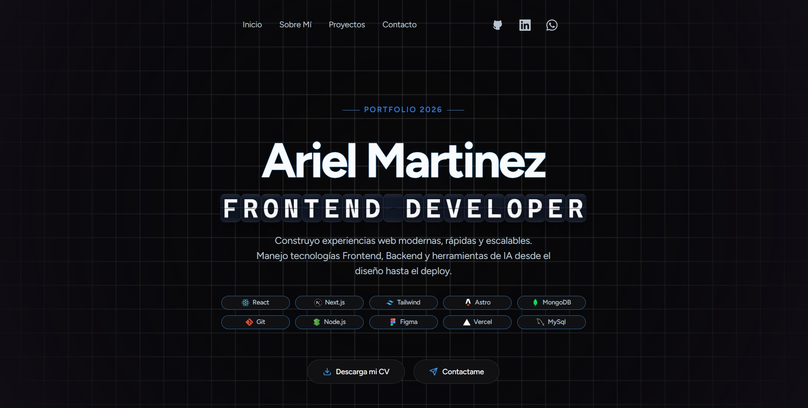

# Ariel Martinez - Portfolio 2026



Portafolio personal construida con las últimas tecnologías web modernas.

[https://arielmartinez.empren.dev/](https://arielmartinez.empren.dev/)

## Tecnologías utilizadas

### Framework y núcleo

- **Next.js 16**
- **React 19**
- **JavaScript (JSX)**

### Estilos

- **Tailwind CSS 4**

### Animaciones

- **React Bits**
- **Framer Motion**

### Iconos y UI

- **lucide-react** — Conjunto de iconos.
- **sonner** — Notificaciones elegantes tipo toast.
- **shadcn/ui** — Componentes reutilizables y accesibles.

### Backend y comunicaciones

- **Next.js API Routes** — Rutas de API en `/api`.
- **Resend** — Envío de emails.
- **axios** — Cliente HTTP para peticiones.

## Scripts

```bash
npm run dev     # Servidor de desarrollo
npm run build   # Compilación de producción
npm run start   # Iniciar servidor de producción
npm run lint    # Análisis de código con ESLint
```

## Estructura

```
src/
├── app/          # Rutas y API de Next.js
├── components/
│   ├── sections/ # Secciones del sitio (Hero, About, Projects, Contact...)
│   ├── ui/       # Componentes reutilizables
│   └── icons/    # Iconos de tecnologías
```
